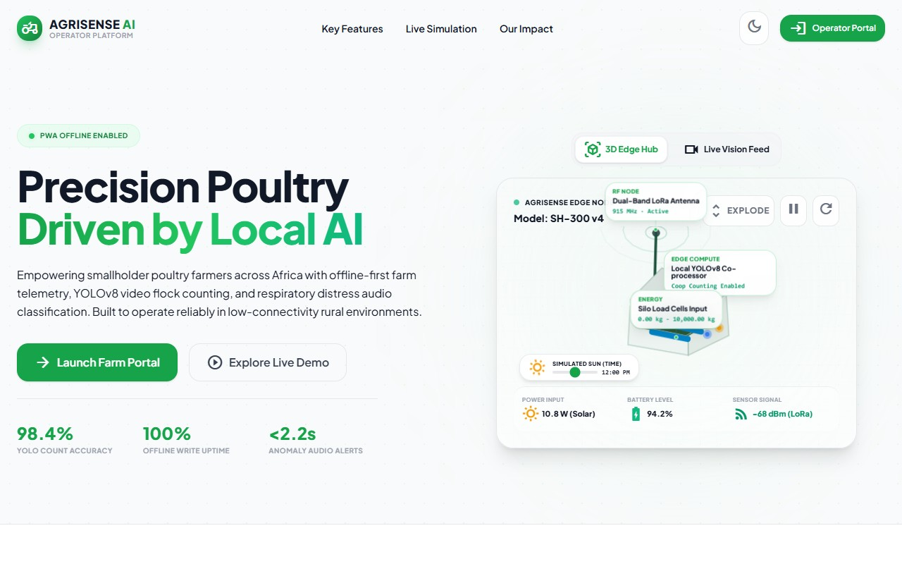
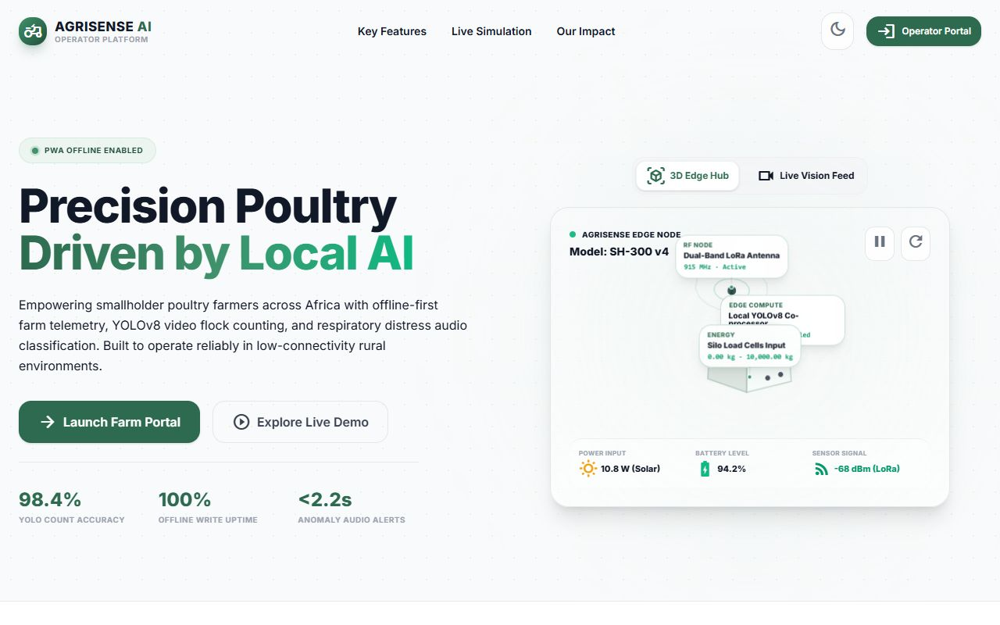
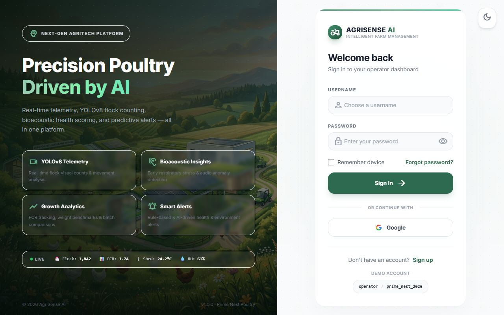

<div align="center">

# 🌱 AgriSense AI

**Smart Poultry Farm Management — Built for African Smallholder Farmers**

[](./backend)
[](./frontend)
[](./docker-compose.yml)
[](./LICENSE)

</div>


---

<div align="center">
  
  <p><em>AgriSense AI Operator Portal & Interactive 3D Edge Hardware Telemetry.</em></p>
</div>

<div align="center">
  
  <p><em>Real-time Farm Dashboard showing live flock counts, mortality alerts, and operational summary.</em></p>
</div>

<div align="center" style="display: flex; justify-content: center; gap: 20px;">
  
  
</div>

---

## 📖 Overview

AgriSense AI is an **offline-first, mobile-friendly farm management dashboard** built specifically for smallholder poultry farmers in Sub-Saharan Africa. 

The pilot farm is **Prime Nest Poultry Farm, Lusaka, Zambia** (coordinated with Evans Kabwe, Apex Youth Initiative). 

Rather than relying on expensive consultants or error-prone paper logbooks, farmers use AgriSense AI to log daily metrics, track growth curves, and run AI-based visual flock audits.

### 🌟 Core Staged Features
*   🔌 **Offline-First Synchronization**: Logs daily metrics and medication events completely offline using localized **IndexedDB** queues, which automatically upload and synchronize to the server once connection is restored.
*   👥 **Multi-Farm Access & Role Roles (RBAC)**: Support for multiple farms per account with division of capabilities across **Owner**, **Operator**, and **Viewer** roles.
*   👁️ **YOLOv8 ByteTrack Audit**: Run automated visual flock audits on coop video footage, returning individual bird tracking histories, movement scores, and discrepancy anomaly warnings (missing count or lethargic birds).

---

## 📚 Technical Documentation Hub

To explore specific sections of the project in detail, please refer to the following documents:

*   📖 **[User & Operator Manual (USER_MANUAL.md)](./USER_MANUAL.md)**: Guide on navigating farms, daily metric logging, interpreting AI reports, and working with offline background sync.
*   🏗️ **[System Architecture Guide (ARCHITECTURE.md)](./ARCHITECTURE.md)**: Explains the three-tier topology, component breakdown, database ER diagrams (including RBAC tables), system flow diagrams, and custom YOLOv8 centroids displacement math.
*   🛠️ **[Developer & Operator Setup Guide (DEVELOPER_GUIDE.md)](./DEVELOPER_GUIDE.md)**: Detailed OS-specific virtual environment activation commands, seeder execution instructions, video processing optimizations, and a troubleshooting FAQ.
*   🤝 **[Contributing Guidelines (CONTRIBUTING.md)](./CONTRIBUTING.md)**: Standards for branch management, commit messages, and submitting PRs.

> [!NOTE]
> **Developer Utility**: The `frontend/take_screenshots.js` file is an automated Puppeteer script used solely for generating documentation screenshot assets (`Docs/assets/`). It is a developer helper tool and not part of the application runtime.

---

## 🚀 Quick Start (Local Development)

For detailed, step-by-step setup instructions for your specific OS/shell, please see the **[Developer Setup Guide](./DEVELOPER_GUIDE.md)**. A summary of the startup commands is listed below:

### 1 — Clone the Repository
```bash
git clone https://github.com/Zakir176/AgriSense-AI-.git
cd AgriSense-AI-
```

### 2 — Database Container Setup
Make sure you have Docker Desktop running, then start the PostgreSQL 15 database:
```bash
docker-compose up -d
```

### 3 — Backend API Setup
```bash
cd backend
python -m venv venv
```

Activate the virtual environment:
```powershell
# Windows (PowerShell)
.\venv\Scripts\Activate.ps1
```
```bash
# macOS / Linux
source venv/bin/activate
```

# For production / Railway deploy (no ultralytics overhead, falls back to mock inference):
# pip install -r requirements.txt

# For local dev with real AI inference (YOLOv8):
pip install -r requirements-full.txt(At initialisation or if not installed already)

python seed_data.py  # Seeds pilot farm and realistic daily metrics(At initialisation)
uvicorn app.main:app --reload --port 8000
```
*   API Docs: [http://localhost:8000/docs](http://localhost:8000/docs) (Swagger Interactive UI)
*   Default Credentials: Username `operator`, Password `prime_nest_2026`

### 4 — Database Migrations (Alembic)

AgriSense AI uses **Alembic** to manage database schema migrations. Run migrations **after** starting the database container and **before** starting the backend for the first time (or after pulling new changes that include model updates).

> **Windows:** prefix the command with `.\venv\Scripts\` if the venv is not activated.

```bash
# Apply all pending migrations to bring the schema up to date
alembic upgrade head

# Roll back the most recent migration
alembic downgrade -1

# Show the current applied migration revision
alembic current

# Show the full migration history
alembic history

# Auto-generate a new migration after changing a SQLAlchemy model
alembic revision --autogenerate -m "describe_your_change"
```

> **Note:** `alembic upgrade head` is idempotent — it is safe to re-run; it will skip revisions that are already applied.

### 5 — Frontend UI Setup
Open a second terminal:
```bash
cd frontend
npm install
npm run dev
```
*   Frontend Dashboard: [http://localhost:5173](http://localhost:5173)

---

## 📡 API Reference Summary

All API endpoints are prefixed with `/api/v1`. For detailed payloads and authorization, see [http://localhost:8000/docs](./DEVELOPER_GUIDE.md).

| Resource Router | Endpoint | Method | Responsibility |
|---|---|---|---|
| **`/auth`** | `/login` | `POST` | Auths operator and returns JWT access token |
| **`/farms`** | `/` | `GET` | Lists farms associated with user |
| **`/batches`** | `/` | `GET`, `POST` | Batch CRUD, closure, and historical archiving |
| **`/readings`** | `/` | `GET`, `POST` | Logs daily feed, water, and mortality counts |
| **`/growth`** | `/` | `GET`, `POST` | Weekly weight sample logs vs Cobb 500 reference curves |
| **`/medications`**| `/` | `GET`, `POST` | Records medical and vaccine cycles with outcomes |
| **`/alerts`** | `/` | `GET` | Threshold and AI-generated alerts sorted by recency |
| **`/inference`** | `/video` | `POST` | Uploads coop video for YOLOv8 counting & speed tracking |

---

## 📋 Roadmap (Future Scope)

- [ ] **SMS & WhatsApp notifications** using Africa's Talking API for operators.
- [ ] **Mobile-native shell wrapper** (Capacitor.js for Android `.apk` generation).
- [ ] **Multi-farm scaling** with role-based access control.
- [ ] **Swahili and Nyanja UI translations**.
- [ ] **YOLOv8 fine-tuning** on local Zambian coop footage.
- [ ] **Distress call classifier** using live audio telemetry.

---

## 📄 License

MIT © 2026 AgriSense AI Contributors
